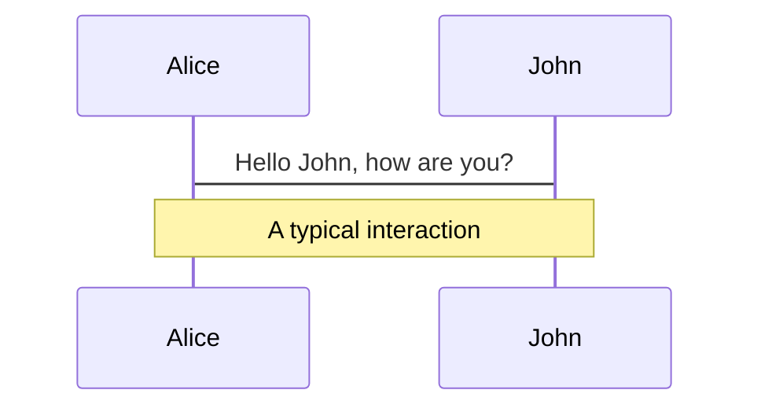
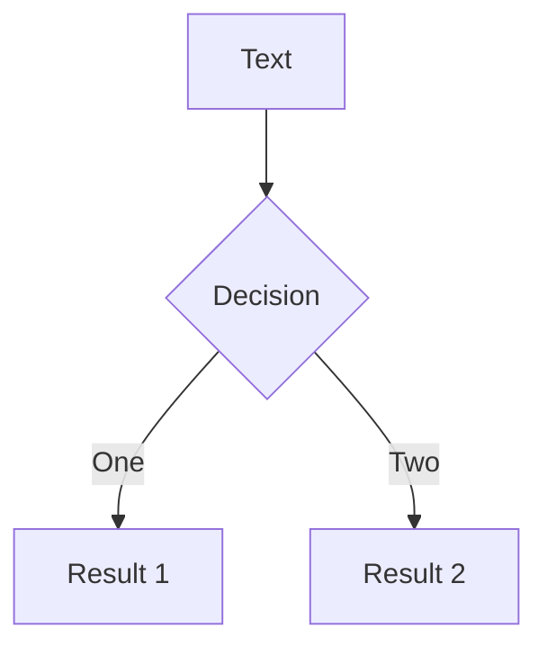
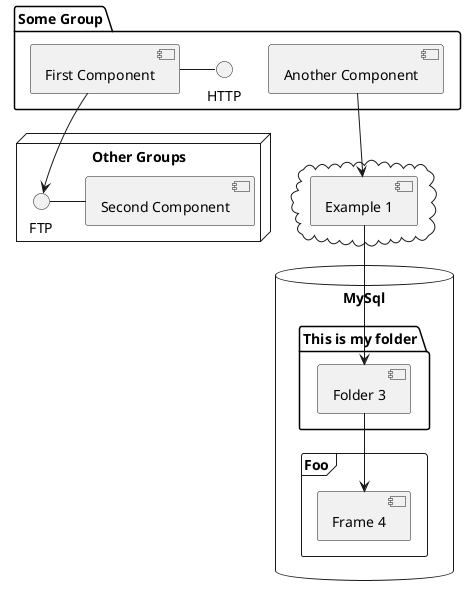

---
# try also 'default' to start simple
theme: seriph
# random image from a curated Unsplash collection by Anthony
# like them? see https://unsplash.com/collections/94734566/slidev
background: https://source.unsplash.com/collection/298137/1920x1080
# apply any windi css classes to the current slide
class: 'text-center'
# https://sli.dev/custom/highlighters.html
highlighter: shiki
# show line numbers in code blocks
lineNumbers: false
# some information about the slides, markdown enabled
info: |
  ## Team's Shopopop
  Presentation slides for developers.

  Learn more at [Sli.dev](https://sli.dev)
# persist drawings in exports and build
drawings:
  persist: false
# Fonts
fonts:
  # le texte
  sans: 'Robot'
  # utiliser avec la classe css `font-serif` de windicss
  serif: 'Robot Slab'
  # pour les blocs de code, le code en ligne, etc.
  mono: 'Fira Code'
---

# Welcome to team's Shopopop

Presentation slides for developers

<div class="pt-12">
  <span @click="$slidev.nav.next" class="px-2 py-1 rounded cursor-pointer" hover="bg-white bg-opacity-10">
    Press Space for next page <carbon:arrow-right class="inline"/>
  </span>
</div>

<div class="abs-br m-6 flex gap-2">
  <button @click="$slidev.nav.openInEditor()" title="Open in Editor" class="text-xl icon-btn opacity-50 !border-none !hover:text-white">
    <carbon:edit />
  </button>
  <a href="https://www.shopopop.com" target="_blank" alt="Shopopop"
    class="text-xl icon-btn opacity-50 !border-none !hover:text-white">
    <carbon:debug />
  </a>
</div>

<!--
The last comment block of each slide will be treated as slide notes. It will be visible and editable in Presenter Mode along with the slide. [Read more in the docs](https://sli.dev/guide/syntax.html#notes)
-->

---
layout: cover
class: text-center
---

# Classe EventEmitter

```ts
const eventEmitter = new EventEmitter();
```


---
layout: center
---

# Architecture événementielle

Une grande partie de l'API principale de Node.js est construite autour d'une architecture événementielle asynchrone idiomatique dans laquelle certains types d'objets (appelés "émetteurs") émettent des événements nommés qui provoquent l'appel d'objets Function ("auditeurs").

Par exemple : un objet net.Server émet un événement chaque fois qu'un pair s'y connecte ; un fs.ReadStream émet un événement lorsque le fichier est ouvert ; un flux émet un événement chaque fois que des données sont disponibles pour être lues.

---
layout: center
---

# Aller plus loin dans les origines

EventEmitter utilise les cycles de boucle d'événements de base de LibUV pour délivrer des événements et exécuter des rappels, ce qui signifie que lorsque vous émettez un événement, il va être ajouté dans la pile de déclenchement d'événements de LibUV pour être déclenché lorsqu'il y a un temps de synchronisation disponible pour cette opération.

---
layout: center
---

# EventEmitter

Tous les objets qui émettent des événements sont des instances de la classe EventEmitter. Ces objets exposent une fonction eventEmitter.on() qui permet d'attacher une ou plusieurs fonctions à des événements nommés émis par l'objet. Généralement, les noms d'événements sont des chaînes en casse camel, mais n'importe quelle clé de propriété JavaScript (ex: Symbol) valide peut être utilisée.

Lorsque l'objet EventEmitter émet un événement, toutes les fonctions attachées à cet événement spécifique sont appelées de manière synchrone. Toutes les valeurs renvoyées par les écouteurs appelés sont ignorées et rejetées.

```
import { EventEmitter } from 'node:events';

const myEmitter = new EventEmitter();

myEmitter.on('event', () => {
  console.log('an event occurred!');
});

myEmitter.emit('event');
```

---
layout: center
---

# Passez des arguments

La méthode eventEmitter.emit() permet de transmettre un ensemble arbitraire d'arguments aux fonctions d'écoute. Gardez à l'esprit que lorsqu'une fonction d'écouteur ordinaire est appelée, la norme this mot-clé est intentionnellement définie pour référencer l'instance EventEmitter à laquelle l'écouteur est attaché.

```ts
import { EventEmitter } from 'node:events';

const myEmitter = new EventEmitter();

myEmitter.on('event', function(a, b) {
  console.log(a, b, this, this === myEmitter);
});

myEmitter.emit('event', 'a', 'b');
```

---
layout: center
---

# EventEmitter asynchrone

L'EventEmitter appelle tous les écouteurs de manière synchrone dans l'ordre dans lequel ils ont été enregistrés. Cela garantit le bon séquencement des événements et permet d'éviter les conditions de course et les erreurs logiques. Le cas échéant, les fonctions d'écoute peuvent basculer vers un mode de fonctionnement asynchrone à l'aide de setImmediate() ou process.nextTick()

```ts
import { EventEmitter } from 'node:events';

const myEmitter = new EventEmitter();

myEmitter.on('event', (a, b) => {
  setImmediate(() => {
    console.log('this happens asynchronously');
  });
});

myEmitter.emit('event', 'a', 'b');
```

---
layout: center
---

# Issues EventEmitter

## Les écouteurs.

Le problème d'avoir trop d'écouteurs. Par défaut, EventEmitter veut que nous maintenions le nombre d'écoiteurs aussi bas que possible car sur chacun, il exécute une boucle de synchronisation sur les rappels, ce qui bloque toute la boucle d'événements.

La limite initiale est de seulement 25 abonnés par événement, ce qui est tout à fait acceptable pour une application moyenne, MAIS vous pouvez augmenter ce nombre autant que vous le souhaitez. Le principal inconvénient d'avoir de grands nombres est le coût des performances du processeur qui en découle.

## Le problème du maintien du niveau de concurrence.

Lorsque vous faites tourner N fois une opération asynchrone, cela crée une file d'attente de promesses dans le pool de threads, cela signifie que si vous émettez un événement (qui est synchronisé), N fois la file d'attente se développe de la même manière. Pour Node.js, cela pourrait entraîner des plantages de dépassement de mémoire ou d'autres erreurs inattendues.

---
layout: center
---

# Conclusion

EventEmitter n'est pas pour chaque cas d'utilisation d'application, et vous pouvez certainement le remplacer par une implémentation personnalisée, MAIS le plus important est de garder à l'esprit qu'EventEmitter est lié aux événements de LibUV qui est le principal moteur de boucle d'événements pour Node .js.

---
layout: center
---

# En savoir plus ...

- [EventEmitter](https://nodejs.dev/fr/learn/the-nodejs-event-emitter/)
- [Nodejs doc api](https://nodejs.dev/fr/api/v19/events/)
- [Documentation events](https://nodejs.org/api/events.html#events)
- [Nodejs Dependencies](https://nodejs.org/en/docs/meta/topics/dependencies)
- [libvu](https://libuv.org)


---
layout: cover
class: text-center
---

# Typescript EventEmitter

```ts
type Events = { ["myEvent"]: (event: string) => Promise<void>; }
```


---

# Typage EventEmitter

Typage partielle de la classe EventEmitter

```ts
type ListenerSignature<L> = {
  [E in keyof L]: (...args: any[]) => any;
}

interface TypedPartialEventEmitter<Events extends ListenerSignature<Events>> {
  on: <E extends keyof Events>(event: E, listener: Events[E]) => this;
  emit: <E extends keyof Events>(event: E, ...args: Parameters<Events[E]>) => boolean;
}
```

---

# Usage exemple

```ts
const Event = Symbol("Event");

type Events = {
  [Event]: (event: number) => Promise<void>;
}

const myEvents = new EventEmitter() as TypedPartialEventEmitter<Events>;

// => type '"hello"' is not assignable to parameter of type 'number'
myEvents.emit(Event, "hello");
```

---
layout: iframe
url: https://github.com/slidevjs/slidev

---

# Summary

Slidev is a slides maker and presenter designed for developers, consist of the following features

- 📝 **Text-based** - focus on the content with Markdown, and then style them later
- 🎨 **Themable** - theme can be shared and used with npm packages
- 🧑‍💻 **Developer Friendly** - code highlighting, live coding with autocompletion
- 🤹 **Interactive** - embedding Vue components to enhance your expressions
- 🎥 **Recording** - built-in recording and camera view
- 📤 **Portable** - export into PDF, PNGs, or even a hostable SPA
- 🛠 **Hackable** - anything possible on a webpage

<br>
<br>

Read more about [Why Slidev?](https://sli.dev/guide/why)

<!--
You can have `style` tag in markdown to override the style for the current page.
Learn more: https://sli.dev/guide/syntax#embedded-styles
-->

<style>
h1 {
  background-color: #2B90B6;
  background-image: linear-gradient(45deg, #4EC5D4 10%, #146b8c 20%);
  background-size: 100%;
  -webkit-background-clip: text;
  -moz-background-clip: text;
  -webkit-text-fill-color: transparent;
  -moz-text-fill-color: transparent;
}
</style>

---

# Navigation

Hover on the bottom-left corner to see the navigation's controls panel, [learn more](https://sli.dev/guide/navigation.html)

### Keyboard Shortcuts

|     |     |
| --- | --- |
| <kbd>right</kbd> / <kbd>space</kbd>| next animation or slide |
| <kbd>left</kbd>  / <kbd>shift</kbd><kbd>space</kbd> | previous animation or slide |
| <kbd>up</kbd> | previous slide |
| <kbd>down</kbd> | next slide |

<!-- https://sli.dev/guide/animations.html#click-animations -->

<p v-after class="absolute bottom-23 left-45 opacity-30 transform -rotate-10">Here!</p>

---
layout: image-right
image: https://source.unsplash.com/collection/94734566/1920x1080
---

# Code

Use code snippets and get the highlighting directly![^1]

```ts {all|2|1-6|9|all}
interface User {
  id: number
  firstName: string
  lastName: string
  role: string
}

function updateUser(id: number, update: User) {
  const user = getUser(id)
  const newUser = {...user, ...update}  
  saveUser(id, newUser)
}
```

<arrow v-click="3" x1="400" y1="420" x2="230" y2="330" color="#564" width="3" arrowSize="1" />

[^1]: [Learn More](https://sli.dev/guide/syntax.html#line-highlighting)

<style>
.footnotes-sep {
  @apply mt-20 opacity-10;
}
.footnotes {
  @apply text-sm opacity-75;
}
.footnote-backref {
  display: none;
}
</style>

---

# Components

<div grid="~ cols-2 gap-4">
<div>

You can use Vue components directly inside your slides.

We have provided a few built-in components like `<Tweet/>` and `<Youtube/>` that you can use directly. And adding your custom components is also super easy.

```html
<Counter :count="10" />
```

<!-- ./components/Counter.vue -->
<Counter :count="10" m="t-4" />

Check out [the guides](https://sli.dev/builtin/components.html) for more.

</div>
<div>

```html
<Tweet id="1390115482657726468" />
```

<Tweet id="1390115482657726468" scale="0.65" />

</div>
</div>


---
class: px-20
---

# Themes

Slidev comes with powerful theming support. Themes can provide styles, layouts, components, or even configurations for tools. Switching between themes by just **one edit** in your frontmatter:

<div grid="~ cols-2 gap-2" m="-t-2">

```yaml
---
theme: default
---
```

```yaml
---
theme: seriph
---
```


</div>

Read more about [How to use a theme](https://sli.dev/themes/use.html) and
check out the [Awesome Themes Gallery](https://sli.dev/themes/gallery.html).

---
preload: false
---

# Animations

Animations are powered by [@vueuse/motion](https://motion.vueuse.org/).

```html
<div
  v-motion
  :initial="{ x: -80 }"
  :enter="{ x: 0 }">
  Slidev
</div>
```

<div class="w-60 relative mt-6">
  <div class="relative w-40 h-40">
    
    
    
  </div>

  <div
    class="text-5xl absolute top-14 left-40 text-[#2B90B6] -z-1"
    v-motion
    :initial="{ x: -80, opacity: 0}"
    :enter="{ x: 0, opacity: 1, transition: { delay: 2000, duration: 1000 } }">
    Slidev
  </div>
</div>

<!-- vue script setup scripts can be directly used in markdown, and will only affects current page -->
<script setup lang="ts">
const final = {
  x: 0,
  y: 0,
  rotate: 0,
  scale: 1,
  transition: {
    type: 'spring',
    damping: 10,
    stiffness: 20,
    mass: 2
  }
}
</script>

<div
  v-motion
  :initial="{ x:35, y: 40, opacity: 0}"
  :enter="{ y: 0, opacity: 1, transition: { delay: 3500 } }">

[Learn More](https://sli.dev/guide/animations.html#motion)

</div>

---

# LaTeX

LaTeX is supported out-of-box powered by [KaTeX](https://katex.org/).

<br>

Inline $\sqrt{3x-1}+(1+x)^2$

Block
$$
\begin{array}{c}

\nabla \times \vec{\mathbf{B}} -\, \frac1c\, \frac{\partial\vec{\mathbf{E}}}{\partial t} &
= \frac{4\pi}{c}\vec{\mathbf{j}}    \nabla \cdot \vec{\mathbf{E}} & = 4 \pi \rho \\

\nabla \times \vec{\mathbf{E}}\, +\, \frac1c\, \frac{\partial\vec{\mathbf{B}}}{\partial t} & = \vec{\mathbf{0}} \\

\nabla \cdot \vec{\mathbf{B}} & = 0

\end{array}
$$

<br>

[Learn more](https://sli.dev/guide/syntax#latex)

---

# Diagrams

You can create diagrams / graphs from textual descriptions, directly in your Markdown.

<div class="grid grid-cols-3 gap-10 pt-4 -mb-6">







</div>

[Learn More](https://sli.dev/guide/syntax.html#diagrams)


---
layout: center
class: text-center
---

# Thank's


[Documentations](https://sli.dev) · [GitHub](https://github.com/slidevjs/slidev) · [Showcases](https://sli.dev/showcases.html)
